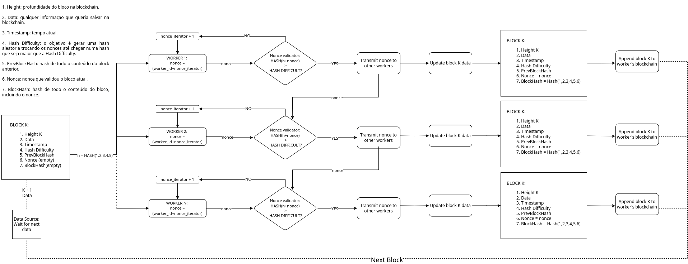

- Para alterar a dificuldade, editar a HASH META em src/HashUtils.h, quanto mais zeros mais difícil.  
- Para aumentar o tempo entre a chegada de dados do data source simulado, editar o sleep no src/DataProducer.cpp.
- A blockchain fica salva no path passado em FILENAME.

Compilar:
    ```make all```  

Executar:
    ```./blockchain <FILENAME> <THREADS> <CHAIN HEIGHT>```  
  
